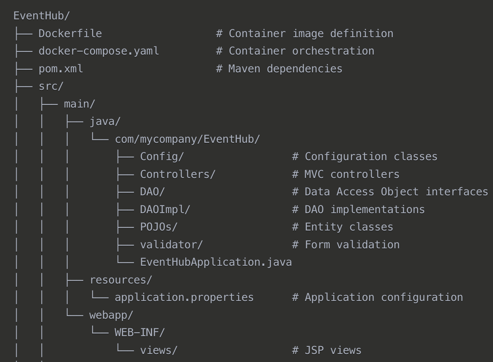

# EventHub - Event Management System

## Table of Contents
- [Project Overview](#project-overview)
- [Features](#features)
- [Technology Stack](#technology-stack)
- [Screenshots](#screenshots)
- [Project Structure](#project-structure)
- [Hibernate Integration](#hibernate-integration)
- [Getting Started](#getting-started)
- [Implementation Highlights](#implementation-highlights)
- [Future Enhancements](#future-enhancements)

## Project Overview

EventHub is a comprehensive event management platform developed as a course project. This system allows organizations to create events, users to register for these events, and administrators to maintain the overall platform. Built on the Spring Boot framework with Hibernate ORM, EventHub demonstrates the implementation of a robust web application using Java technologies.

## Features

### User Roles

EventHub implements a multi-role authorization system with three types of users:

1. **Administrators**
   - Complete system management
   - Monitor all events, organizers, and customers
   - Edit or remove content as needed

2. **Organizers**
   - Create and manage events
   - View registered participants
   - Update event details

3. **Customers**
   - Browse available events
   - Register for events
   - Manage event registrations
   - Update personal profile information

### Key Functionalities

- **User Authentication**: Secure login and registration system
- **Event Management**: Creation, editing, and deletion of events
- **Registration System**: Customers can register for events with capacity limits
- **Search & Filter**: Find events by keyword or category
- **Responsive UI**: Bootstrap-based interface that works across devices
- **Data Persistence**: Hibernate ORM with SQL Server database
- **Pagination**: Efficient display of event lists with page navigation

## Technology Stack

- **Backend**: Java with Spring Boot framework
- **Frontend**: JSP, HTML, CSS, JavaScript
- **Database**: Microsoft SQL Server
- **ORM**: Hibernate
- **Build Tool**: Maven
- **Design Pattern**: DAO pattern for data access

## Screenshots

### User Experience Journey

<div align="center">

#### 🔐 Authentication
<table>
  <tr>
    <td width="50%"></td>
    <td width="50%"></td>
  </tr>
  <tr>
    <td><em>Streamlined login with role selection</em></td>
    <td><em>Intuitive registration process</em></td>
  </tr>
</table>

#### 👑 Administrator Experience
<table>
  <tr>
    <td colspan="2"></td>
  </tr>
  <tr>
    <td colspan="2"><em>Comprehensive administrative dashboard for platform oversight</em></td>
  </tr>
  <tr>
    <td></td>
    <td></td>
  </tr>
  <tr>
    <td><em>Customer management and monitoring</em></td>
    <td><em>Organizer approval and management</em></td>
  </tr>
  <tr>
    <td colspan="2"></td>
  </tr>
  <tr>
    <td colspan="2"><em>Platform-wide event moderation capabilities</em></td>
  </tr>
</table>

#### 🎭 Organizer Portal
<table>
  <tr>
    <td width="50%"></td>
    <td width="50%"></td>
  </tr>
  <tr>
    <td><em>Analytics-driven dashboard for event creators</em></td>
    <td><em>Comprehensive event management tools</em></td>
  </tr>
  <tr>
    <td></td>
    <td></td>
  </tr>
  <tr>
    <td><em>Intuitive event creation interface</em></td>
    <td><em>Attendee tracking and management</em></td>
  </tr>
  <tr>
    <td colspan="2"></td>
  </tr>
  <tr>
    <td colspan="2"><em>Organizer profile customization</em></td>
  </tr>
</table>

#### 🧑‍💼 Customer Experience
<table>
  <tr>
    <td colspan="2"></td>
  </tr>
  <tr>
    <td colspan="2"><em>Personalized customer dashboard highlighting upcoming events</em></td>
  </tr>
  <tr>
    <td></td>
    <td></td>
  </tr>
  <tr>
    <td><em>Event discovery with filtering and search</em></td>
    <td><em>Registration tracking and management</em></td>
  </tr>
  <tr>
    <td></td>
    <td></td>
  </tr>
  <tr>
    <td><em>Seamless event registration process</em></td>
    <td><em>Hassle-free registration cancellation</em></td>
  </tr>
  <tr>
    <td colspan="2"></td>
  </tr>
  <tr>
    <td colspan="2"><em>User profile management and preferences</em></td>
  </tr>
</table>

</div>


## Project Structure

The application follows a standard layered architecture:



The project is organized as follows:

1. **Controllers Layer**: Handles HTTP requests and manages user interaction flow
   - AdminController: Manages administrative tasks
   - HomeController: Handles authentication and common pages
   - OrganizerController: Manages event creation and organizer functions
   - CustomerController: Manages event browsing and registration

2. **DAO Layer**: Implements Data Access Object pattern
   - Abstract DAO base class with common methods
   - Specialized DAOs for each entity (AdminDAO, EventDAO, etc.)
   - Uses Hibernate/JPA for database operations

3. **POJOs Layer**: Plain Old Java Objects representing domain entities
   - User (abstract base class)
   - Admin, Organizer, Customer (extend User)
   - Event with relationships to other entities

4. **Validators**: Form validation for data integrity
   - Validates user input before processing

5. **Configuration**: System setup and initialization
   - DataInitializer for sample data generation

This structure provides clear separation of concerns, making the codebase maintainable and extensible.

## Hibernate Integration

EventHub utilizes Hibernate ORM for database operations, providing an abstraction layer between the application and the database. This integration offers several advantages:

### Configuration

The application connects to Microsoft SQL Server through Hibernate, configured in `application.properties`:

```properties
# DataSource Configuration
spring.datasource.url=jdbc:sqlserver://localhost:1433;databaseName=EventHub;encrypt=true;trustServerCertificate=true
spring.datasource.username=sa
spring.datasource.password=******
spring.datasource.driver-class-name=com.microsoft.sqlserver.jdbc.SQLServerDriver

# Hibernate Configuration
spring.jpa.properties.hibernate.dialect=org.hibernate.dialect.SQLServerDialect
spring.jpa.hibernate.ddl-auto=update
spring.jpa.hibernate.naming.physical-strategy=org.hibernate.boot.model.naming.PhysicalNamingStrategyStandardImpl
spring.jpa.show-sql=true
spring.jpa.properties.hibernate.format_sql=true
```

## Getting Started

### Prerequisites

- JDK 17 or higher
- Maven
- Microsoft SQL Server

### Setup Instructions

1. Clone the repository
2. Configure database connection in `application.properties`
3. Run the application using Spring Boot:
   ```
   mvn spring-boot:run
   ```
4. Access the application at `http://localhost:8080/eventhub`

### Default Users

The system is pre-populated with the following test accounts:

| Role      | Username | Password |
|-----------|----------|----------|
| Admin     | aaa      | aaa      |
| Organizer | o1       | ooo111   |
| Organizer | o2       | ooo222   |
| Organizer | o3       | ooo333   |
| Customer  | c1       | ccc111   |
| Customer  | c2       | ccc222   |
| Customer  | c3       | ccc333   |

## Implementation Highlights

### DAO Pattern Implementation

The project uses the Data Access Object pattern to separate business logic from data access.
This approach offers better maintainability and testability.

```java
// Example of DAO interface
public interface EventDAO {
    Event save(Event event);
    Optional findById(Long id);
    List findAll();
    List findByCategory(String category);
    List searchByKeyword(String keyword);
    // Other methods...
}
```

### Session-Based Authentication

User authentication is handled through session management:

```java
// Authentication method example
private boolean authenticateCustomer(String username, String password, HttpSession session) {
    customerDAO.findByUsername(username).ifPresent(customer -> {
        if (customer.getPassword().equals(password)) {
            session.setAttribute("currentUser", customer);
            session.setAttribute("userType", "customer");
            session.setAttribute("userId", customer.getId());
        }
    });
    
    return session.getAttribute("currentUser") != null;
}
```

### JPA Entity Relationships

The system demonstrates various JPA relationship mappings:

```java
// Example of a many-to-many relationship
@ManyToMany
@JoinTable(
    name = "customer_event_registrations",
    joinColumns = @JoinColumn(name = "customer_id"),
    inverseJoinColumns = @JoinColumn(name = "event_id")
)
private Set registeredEvents = new HashSet<>();
```


## Future Enhancements

Several areas for future development have been identified:

### Security Enhancements
* Implementation of Spring Security for more robust authentication
* Password encryption with bcrypt or similar algorithms
* Role-based access control with more granular permissions

### Feature Expansions
* Email notifications for event reminders and updates
* Payment processing integration for paid events
* Social media sharing capabilities
* QR code generation for event tickets
* Rating and review system for past events

### Technical Improvements
* RESTful API for mobile application integration
* Implementation of caching for frequently accessed data
* Comprehensive unit and integration test suite
* Deployment to cloud platforms (AWS, Azure, etc.)
* Performance optimization for higher scalability

### User Experience
* Advanced search filters (location, date range, price)
* Interactive event calendar view
* User dashboards with analytics
* Customizable event pages for organizers

These enhancements would transform EventHub from a course project into a production-ready system capable of serving real-world event management needs.
